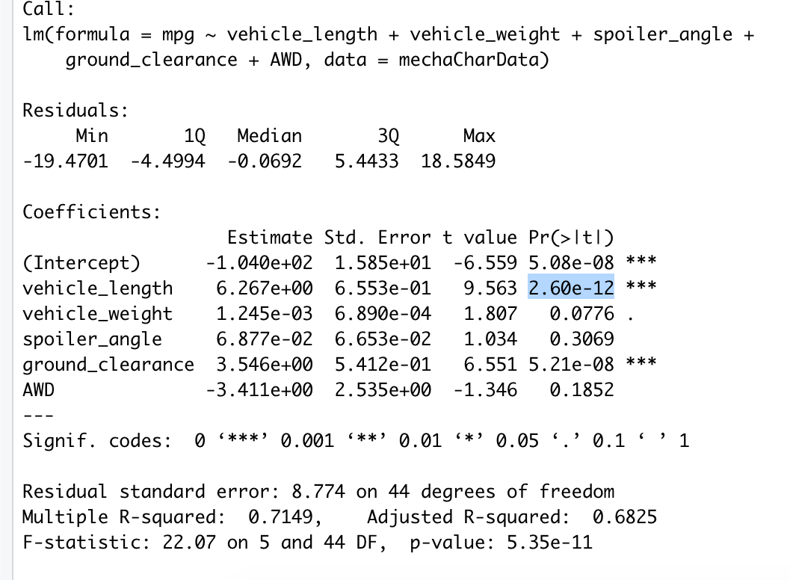
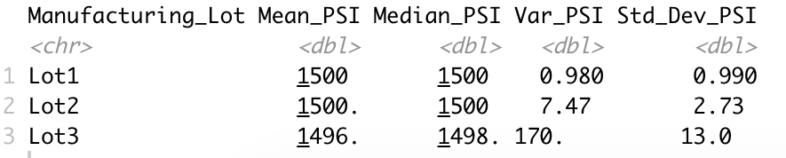
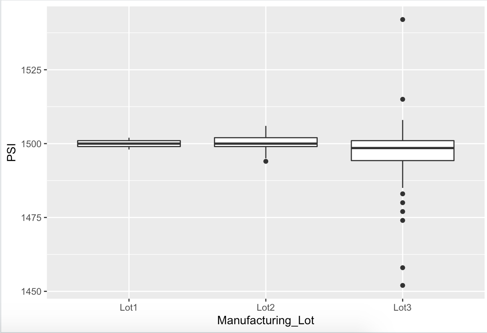
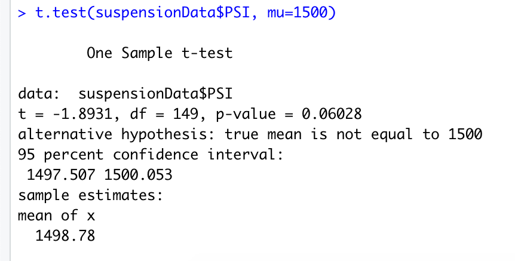

# Vehicle_Statistical_Analysis

## Project Overview
* Use statistics and hypothesis testing to analyze a series of dataset from an automotive company, AutosRUs.
* Statistical analysis and visualization for this project was all done in the R programming language.

## Resources
* Data Source: [MechaCar_mpg.csv](Resources/MechaCar_mpg.csv), [Suspension_Coil.csv](Resources/Suspension_Coil.csv)
* The `MechaCar_mpg.csv` dataset contains mpg test results for 50 prototype MechaCars. The MechaCar prototypes were produced using multiple design specifications to identify ideal vehicle performance. Multiple metrics, such as vehicle length, vehicle weight, spoiler angle, drivetrain, and ground clearance, were collected for each vehicle
* The `Suspension_Coil.csv` dataset contains the results from multiple production lots. In this dataset, the weight capacities of multiple suspension coils were tested to determine if the manufacturing process is consistent across production lots.

## Linear Regression to Predict MPG

### Analysis 
* `MechaCar_mpg.csv` was imported and read into a dataframe
    > mechaCharData <- read.csv(file="Resources/MechaCar_mpg.csv",check.names=F,stringsAsFactors = F)
* An R code for a linear regression model
    > lm(mpg ~ vehicle_length + vehicle_weight + spoiler_angle + ground_clearance + AWD, data=mechaCharData)
* An R code for the statistical summary of the linear regression model with the intended p-values
    > summary(lm(mpg ~ vehicle_length + vehicle_weight + spoiler_angle + ground_clearance + AWD, data=mechaCharData))

### Result

* In the output, each number in the `Pr(>|t|)` column represents how statistically likely each variable provides a non-random amount of variance to the mpg values in the dataset. According to the summary, the **vehicle length** and **vehicle ground clearance** have a significant impact on miles per gallon on the MechaCar prototype. On the other hand, the **vehicle weight**, **spoiler angle**, and **All Wheel Drive (AWD)** have p-values that indicate a random amount of variance with the dataset.

* The p-value for this model is `5.35e-11` and it is much smaller than the assumed significance level of `0.05%`. That is, there is enough evidence to **reject the null hypothesis**, which can be understood that the slope of this linear model is **not zero**.

* The R-sqaured value is 0.7149 and it means that about 71-72% of all mpg predictions could be determined by this model. This is a  relatively high percentage so it can be deduced that this multiple regression model `does predict mpg of MechaCar prototypes quite effectively`.

## Summary Statistics on Suspension Coils

### Analysis
* `Suspension_Coil.csv` was imported and read into a dataframe
    > suspensionData <- read.csv(file="Resources/Suspension_Coil.csv",check.names=F,stringsAsFactors = F)

* An R code to create a total summary dataframe with the mean, median, variance, and standard deviation of the PSI for all manufacturing lots
    > total_summary <- suspensionData %>% summarize(Mean_PSI=mean(PSI), Median_PSI=median(PSI), Var_PSI=var(PSI), Std_Dev_PSI=sd(PSI), .groups='keep')

* An R code to create a lot summary dataframe that has the mean, median, variance, and standard deviation for each manufacturing lot
    > lot_summary <- suspensionData %>% group_by(Manufacturing_Lot) %>% summarize(Mean_PSI=mean(PSI), Median_PSI=median(PSI), Var_PSI=var(PSI), Std_Dev_PSI=sd(PSI, .groups='keep')

### Result
* Understanding that the design specifications for the MechaCar suspension coils dictate that the variance of the suspension coils must not exceed 100 pounds per square inch, we are to answer the following question:
> Does the current manufacturing data meet the design specification for all manufacturing lots in total and each lot individually? Why or why not?

* From the `total_summary` dataframe, the variance of the coils is 62.29 PSI, which is well under the 100 PSI requirement. When looking at the individual lot in the `lot_summary` dataframe, it is observed that Lot 1 and Lot 2 are well within the 100 PSI varaince requirement; Lot 1 with 0.98 and Lot 2 with 7.47 as their variance. In contrast, the variance value of 170.29 for Lot 3 is well above the requirement value. So it can be deduced that Lot 3 is increasing the variance value at the full lot level.

* The following boxplot shows how Lot 3 causes inconsistency in PSI:

> plt <- ggplot(suspensionData, aes(x=Manufacturing_Lot, y=PSI))

> plt + geom_boxplot()

## T-Tests on Suspension Coils

## Analysis
* For this section, we are to perform t-tests to determine if all manufacturing lots and each lot individually are statistically different from the population mean of 1,500 pounds per square inch.

* An R code for t-test that compares all manufacturing lots against the presumed population mean of 1,500 PSI
> t.test(suspensionData$PSI, mu=1500)

The following is a summary of the t-test results across **all manufacturing lots**

From this result, it can be observed that the **true mean is 1498.78**. This is the same number we saw for the mean value in `total_summary` dataframe. Here, we have 0.06 as a p-Value and it is higher than the assumed significance level of 0.05. Therefore, it can be determined that there is `no sufficient` evidence to reject the null hypothesis. In other words, the mean of all three of the manufacturing lots is statistically similar to the presumed population mean of 1,500.